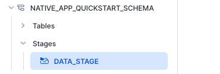

# Alternate directions for Quickstart


- Page 1 getting setup (CLI listed but this document negates that need)
- Page 2 Architecture Setup
- Page 3 If you can clone the repo then do else download from [here](https://github.com/Snowflake-Labs/sfguide-getting-started-with-native-apps)
- Page 4 Copying data into the tables.  this would normally be done using snow SQL and by executing the *prepare_data.sh* script but not to worry.  If you want then have a look in there to see how it is done.  We will be doing this manually 

Go into Snowsight, open a worksheet, execute the following

```sql
CREATE OR REPLACE WAREHOUSE NATIVE_APP_QUICKSTART_WH WAREHOUSE_SIZE=SMALL INITIALLY_SUSPENDED=TRUE;

-- this database is used to store our data
CREATE OR REPLACE DATABASE NATIVE_APP_QUICKSTART_DB;
USE DATABASE NATIVE_APP_QUICKSTART_DB;

CREATE OR REPLACE SCHEMA NATIVE_APP_QUICKSTART_SCHEMA;
USE SCHEMA NATIVE_APP_QUICKSTART_SCHEMA;

-- create provider shipping data table
CREATE OR REPLACE TABLE MFG_SHIPPING (
  order_id NUMBER(38,0), 
  ship_order_id NUMBER(38,0),
  status VARCHAR(60),
  lat FLOAT,
  lon FLOAT,
  duration NUMBER(38,0)
);

--create consumer orders data table
USE WAREHOUSE NATIVE_APP_QUICKSTART_WH;
-- this database is used to store our data
USE DATABASE NATIVE_APP_QUICKSTART_DB;

USE SCHEMA NATIVE_APP_QUICKSTART_SCHEMA;

CREATE OR REPLACE TABLE MFG_ORDERS (
  order_id NUMBER(38,0), 
  material_name VARCHAR(60),
  supplier_name VARCHAR(60),
  quantity NUMBER(38,0),
  cost FLOAT,
  process_supply_day NUMBER(38,0)
);

-- create consumer recovery data table
CREATE OR REPLACE TABLE MFG_SITE_RECOVERY (
  event_id NUMBER(38,0), 
  recovery_weeks NUMBER(38,0),
  lat FLOAT,
  lon FLOAT
);

```

The next part of this script uses the Snow CLI to copy files into the stages that are used internally by the tables

we will do that manually.

In Snowsight execute

```sql
CREATE STAGE NATIVE_APP_QUICKSTART_DB.NATIVE_APP_QUICKSTART_SCHEMA.DATA_STAGE;
```

 Now look in your folder structure under app/data you will see the three files we need to upload to the stage.

 In Snowsight navigate to Data/Databases
 Expand NATIVE_APP_QUICKSTART_DB and then NATIVE_APP_QUICKSTART_SCHEMA and then Stages
 Click on DATA_STAGE.

 
 
 Enable Directory Table (blue button)
 click +Files button (Top right)
 
  

Drag the three files into the box and specify data as the path

Then click Upload.  What we have done here is the same as the QS does with snow stage copy ...

  

Now we need to copy those files from the stage into the tables we created in the previous step.

In Snowsight execute the following

```sql
USE WAREHOUSE NATIVE_APP_QUICKSTART_WH;
-- this database is used to store our data
USE DATABASE NATIVE_APP_QUICKSTART_DB;

USE SCHEMA NATIVE_APP_QUICKSTART_SCHEMA;

COPY INTO MFG_SHIPPING
FROM @DATA_STAGE/data/shipping_data.csv
FILE_FORMAT = (TYPE = CSV
FIELD_OPTIONALLY_ENCLOSED_BY = '\"');

COPY INTO MFG_ORDERS
FROM '@DATA_STAGE/data/order_data.csv'
FILE_FORMAT = (TYPE = CSV
FIELD_OPTIONALLY_ENCLOSED_BY = '\"');

COPY INTO MFG_SITE_RECOVERY
FROM '@DATA_STAGE/data/site_recovery_data.csv'
FILE_FORMAT = (TYPE = CSV
FIELD_OPTIONALLY_ENCLOSED_BY = '\"');

SELECT * FROM MFG_SHIPPING;
```

 - 5 this script would normally be run when we use the snow CLI (Step 8) but we can do it manually.  It is creating an APPLICATION PACKAGE  This is the PACKAGE that is used to deinfe what objects the provider of the application will share with the consumers.  When running useing the Snow CLI, the command uses the snowflake.yml file to know what the name of the package will be and also where to find the artefacts to deploy.


 ```sql
-- ################################################################
-- Create SHARED_CONTENT_SCHEMA to share in the application package
-- ################################################################
CREATE APPLICATION PACKAGE NATIVE_APP_QUICKSTART_PACKAGE;

use APPLICATION PACKAGE NATIVE_APP_QUICKSTART_PACKAGE;
create schema shared_content_schema;

use schema shared_content_schema;
create or replace view MFG_SHIPPING as select * from NATIVE_APP_QUICKSTART_DB.NATIVE_APP_QUICKSTART_SCHEMA.MFG_SHIPPING;

grant usage on schema shared_content_schema to share in application package NATIVE_APP_QUICKSTART_PACKAGE;
grant reference_usage on database NATIVE_APP_QUICKSTART_DB to share in application package NATIVE_APP_QUICKSTART_PACKAGE;
grant select on view MFG_SHIPPING to share in application package NATIVE_APP_QUICKSTART_PACKAGE;
```

- 6 describes the manifest file
- 7 describes the setup.sql file.  This installs objects into our application when the application is created.  Let's jump to step 9 and then step 10 before returning back here.  

- Step 8 instead of executing snow app run we need to go copy some files into a stage.

```sql
--CREATE the stage to hold our artefacts
CREATE SCHEMA NATIVE_APP_QUICKSTART_PACKAGE.INTERNAL;
CREATE STAGE NATIVE_APP_QUICKSTART_PACKAGE.INTERNAL.ARTEFACTS;
```

Now copy in everything under /app/src.  

  

You can only copy files so will need to do 2 copies, one to the root and one to the /libraries path

  

- Step 9 & 10 done

- Step 11 We can do this using SQL

```sql
ALTER APPLICATION PACKAGE NATIVE_APP_QUICKSTART_PACKAGE
  ADD VERSION V1
  USING '@NATIVE_APP_QUICKSTART_PACKAGE.INTERNAL.ARTEFACTS';
```
  

--Step 12 AS IS


--Step 13 Go to Data  Products/Apps and click on your new app.
It is going to prompt you for access to tables we loaded earlier.
